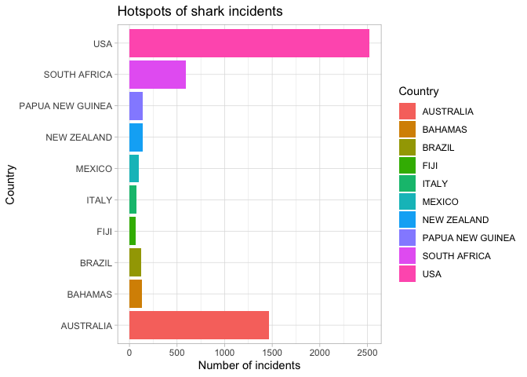
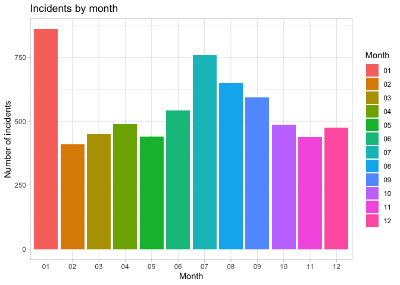
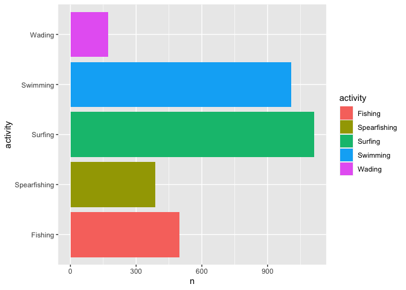
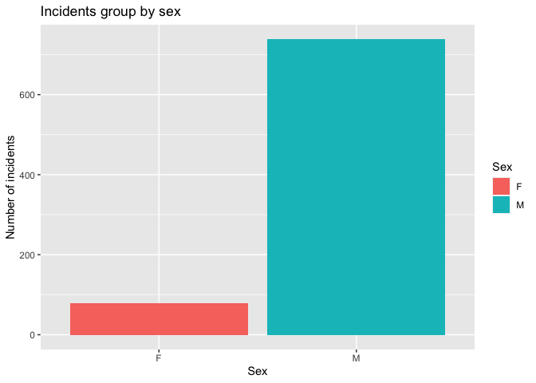
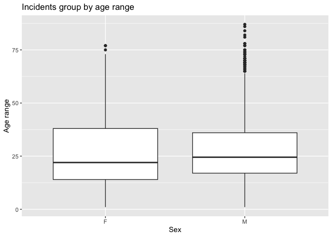
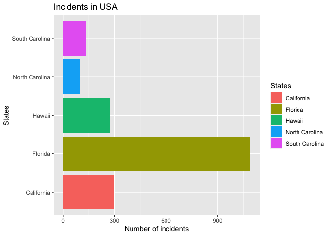
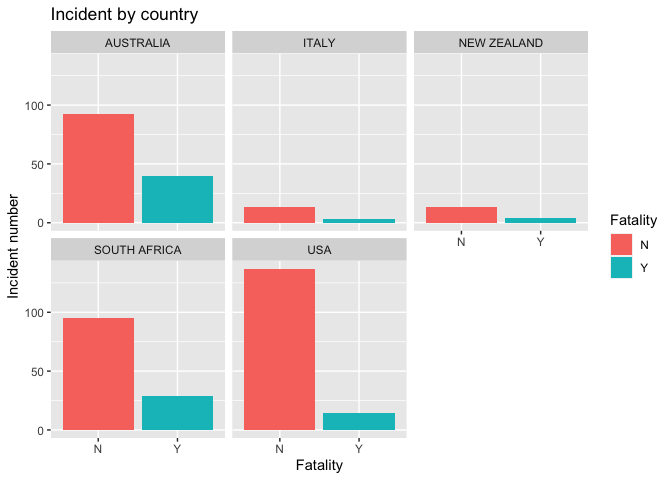
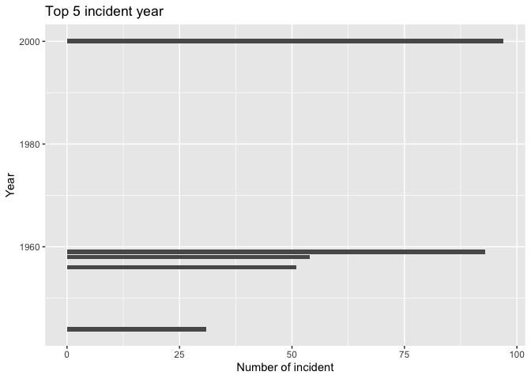

## Instructions
Answer the following questions and complete the exercises in RMarkdown. Please embed all of your code and push your final work to your repository. Your code must be organized, clean, and run free from errors. Remember, you must remove the `#` for any included code chunks to run. Be sure to add your name to the author header above. 

Your code must knit in order to be considered. If you are stuck and cannot answer a question, then comment out your code and knit the document.  

Don't forget to answer any questions that are asked in the prompt. Some questions will require a plot, but others do not- make sure to read each question carefully.  

For the questions that require a plot, make sure to have clearly labeled axes and a title. Keep your plots clean and professional-looking, but you are free to add color and other aesthetics.  

Be sure to follow the directions and push your code to your repository.

## Background
In the `data` folder, you will find data about global shark attacks. The data are updated continuously, and are taken from [opendatasoft](https://public.opendatasoft.com/explore/dataset/global-shark-attack/table/?flg=en-us&disjunctive.country&disjunctive.area&disjunctive.activity).  

## Load the libraries

```r
library("tidyverse")
library("janitor")
library("naniar")
```

## Load the data
Run the following code chunk to import the data.

```r
global_sharks <- read_csv("data/global-shark-attack.csv") %>% clean_names()
```

## Questions
1. (2 points) Start by doing some data exploration using your preferred function(s). What is the structure of the data? Where are the missing values and how are they represented?  

```r
str(global_sharks)
```

```
## spc_tbl_ [6,890 × 21] (S3: spec_tbl_df/tbl_df/tbl/data.frame)
##  $ date                  : Date[1:6890], format: "2023-07-29" "2023-04-22" ...
##  $ year                  : num [1:6890] 2023 2023 2023 2023 2022 ...
##  $ type                  : chr [1:6890] "Unprovoked" "Unprovoked" "Unprovoked" "Questionable" ...
##  $ country               : chr [1:6890] "USA" "AUSTRALIA" "SEYCHELLES" "ARGENTINA" ...
##  $ area                  : chr [1:6890] "Florida" "Western Australia" "Praslin Island" "Patagonia" ...
##  $ location              : chr [1:6890] "Tampa Bay" "Lucy's Beach" NA "Chubut Province" ...
##  $ activity              : chr [1:6890] "Swimming" "Surfing" "Snorkeling" NA ...
##  $ name                  : chr [1:6890] "Natalie Branda" "Max Marsden" "Arthur \xc9" "Diego Barr\x92a" ...
##  $ sex                   : chr [1:6890] "F" "M" "M" "M" ...
##  $ age                   : chr [1:6890] "26" "30" "6" "32" ...
##  $ injury                : chr [1:6890] "Superficial injuries to abomen and thighs" "Bite to right arm" "Left foot bitten" "Death by misadventure" ...
##  $ fatal_y_n             : chr [1:6890] "N" "N" "UNKNOWN" "UNKNOWN" ...
##  $ time                  : chr [1:6890] "20h00" "07h15" "Afternoon" NA ...
##  $ species               : chr [1:6890] NA "Bronze whaler shark, 1.5 m" "Lemon shark" NA ...
##  $ investigator_or_source: chr [1:6890] "Fox12, 8/1/2023" "The West Australian, 4/22/2023" "Midlibre, 3/18/2023" "El Pais,  2/27/2023" ...
##  $ pdf                   : chr [1:6890] NA NA NA NA ...
##  $ href_formula          : chr [1:6890] NA NA NA NA ...
##  $ href                  : chr [1:6890] NA NA NA NA ...
##  $ case_number_19        : chr [1:6890] NA NA NA NA ...
##  $ case_number_20        : chr [1:6890] NA NA NA NA ...
##  $ original_order        : num [1:6890] NA NA NA NA 6792 ...
##  - attr(*, "spec")=
##   .. cols(
##   ..   Date = col_date(format = ""),
##   ..   Year = col_double(),
##   ..   Type = col_character(),
##   ..   Country = col_character(),
##   ..   Area = col_character(),
##   ..   Location = col_character(),
##   ..   Activity = col_character(),
##   ..   Name = col_character(),
##   ..   Sex = col_character(),
##   ..   Age = col_character(),
##   ..   Injury = col_character(),
##   ..   `Fatal (Y/N)` = col_character(),
##   ..   Time = col_character(),
##   ..   Species = col_character(),
##   ..   `Investigator or Source` = col_character(),
##   ..   pdf = col_character(),
##   ..   `href formula` = col_character(),
##   ..   href = col_character(),
##   ..   `Case Number...19` = col_character(),
##   ..   `Case Number...20` = col_character(),
##   ..   `original order` = col_double()
##   .. )
##  - attr(*, "problems")=<externalptr>
```


```r
miss_var_summary(global_sharks)
```

```
## # A tibble: 21 × 3
##    variable n_miss pct_miss
##    <chr>     <int>    <dbl>
##  1 time       3518    51.1 
##  2 species    3118    45.3 
##  3 age        2982    43.3 
##  4 activity    586     8.51
##  5 sex         572     8.30
##  6 location    565     8.20
##  7 area        481     6.98
##  8 date        305     4.43
##  9 name        220     3.19
## 10 year        132     1.92
## # ℹ 11 more rows
```


2. (3 points) Are there any "hotspots" for shark incidents? Make a plot that shows the total number of incidents for the top 10 countries? Which country has the highest number of incidents?


```r
global_sharks %>% 
  count(country) %>% 
  arrange(desc(n))
```

```
## # A tibble: 216 × 2
##    country              n
##    <chr>            <int>
##  1 USA               2522
##  2 AUSTRALIA         1464
##  3 SOUTH AFRICA       596
##  4 NEW ZEALAND        142
##  5 PAPUA NEW GUINEA   136
##  6 BAHAMAS            132
##  7 BRAZIL             122
##  8 MEXICO             100
##  9 ITALY               72
## 10 FIJI                67
## # ℹ 206 more rows
```

```r
global_sharks %>% 
  count(country) %>% 
  arrange(desc(n))%>% 
  top_n(10, n) %>% 
  ggplot(aes(x=country, y=n, fill = country))+
  geom_col()+
  coord_flip()+
  theme_light()+
  labs(title = "Hotspots of shark incidents",
       x = "Country", 
       y = "Number of incidents",
       fill = "Country")
```

<!-- -->


3. (3 points) Are there months of the year when incidents are more likely to occur? Make a plot that shows the total number of incidents by month. Which month has the highest number of incidents?

Janurary has the highest number of incidents

```r
global_sharks %>% 
  separate(date, into= c("year", "month", "day"), sep = "-") %>% 
  mutate(month = as.factor(month)) %>% 
  filter(month != "NA") %>% 
  count(month) %>% 
  arrange(desc(n))
```

```
## # A tibble: 12 × 2
##    month     n
##    <fct> <int>
##  1 01      859
##  2 07      757
##  3 08      649
##  4 09      592
##  5 06      542
##  6 04      489
##  7 10      486
##  8 12      475
##  9 03      448
## 10 05      441
## 11 11      438
## 12 02      409
```

```r
global_sharks %>% 
  separate(date, into= c("year", "month", "day"), sep = "-") %>% 
  mutate(month = as.factor(month)) %>% 
  filter(month != "NA") %>% 
  count(month) %>% 
  arrange(desc(n)) %>% 
  ggplot(aes(x = month, y=n, fill = month))+
  geom_col(na.rm = TRUE)+
  theme_light()+
  labs(title = "Incidents by month",
       x = "Month", 
       y = "Number of incidents", 
       fill = "Month")
```

<!-- -->


4. (3 points) Which activity is associated with the highest number of incidents? Make a plot that compares the top 5 riskiest activities. "NA" should not be classified as an activity.

Surfing has the highest number of incidents

```r
global_sharks %>% 
  filter(activity != "NA") %>% 
  count(activity) %>% 
  arrange(desc(n))
```

```
## # A tibble: 1,553 × 2
##    activity         n
##    <chr>        <int>
##  1 Surfing       1112
##  2 Swimming      1009
##  3 Fishing        498
##  4 Spearfishing   387
##  5 Wading         171
##  6 Bathing        166
##  7 Diving         145
##  8 Snorkeling     127
##  9 Standing       115
## 10 Scuba diving    83
## # ℹ 1,543 more rows
```


```r
global_sharks %>% 
  filter(activity != "NA") %>% 
  count(activity) %>% 
  arrange(desc(n)) %>% 
  head(5, activity) %>% 
  ggplot(aes(x=activity, y=n, fill = activity))+
  geom_col()+
  coord_flip()
```

<!-- -->


5. (3 points) The data include information on who was attacked. Make a plot that shows the total number of fatalities by sex- are males or females more likely to be killed by sharks?

Males are more likely to be killed by sharks

```r
global_sharks %>% 
  group_by(sex) %>% 
  filter(sex == "M" | sex == "F") %>% 
  filter(injury == "FATAL") %>% 
  count(injury)
```

```
## # A tibble: 2 × 3
## # Groups:   sex [2]
##   sex   injury     n
##   <chr> <chr>  <int>
## 1 F     FATAL     78
## 2 M     FATAL    738
```

```r
global_sharks %>% 
  group_by(sex) %>% 
  filter(sex == "M" | sex == "F") %>% 
  filter(injury == "FATAL") %>% 
  count(injury) %>% 
  ggplot(aes(x=sex, y=n, fill = sex))+
  geom_col()+
  labs(title = "Incidents group by sex",
       x = "Sex", 
       y = "Number of incidents",
       fill = "Sex")
```

<!-- -->


6. (3 points) Make a plot that shows the range of age for the individuals that are attacked. Make sure to restrict sex to M or F (some of the codes used are not clear). You will also need to find a way to manage the messy age column.

```r
global_sharks %>% 
  filter(sex == "M" | sex == "F") %>%
  mutate(age = as.integer(age)) %>% 
  filter(age != "NA") %>% 
  ggplot(aes(x = sex, y = age, filter = sex))+
  geom_boxplot(na.rm =T)+
  labs(title = "Incidents group by age range",
       x = "Sex",
       y = "Age range",
       fill = "Sex")
```

```
## Warning: There was 1 warning in `mutate()`.
## ℹ In argument: `age = as.integer(age)`.
## Caused by warning:
## ! NAs introduced by coercion
```

<!-- -->


7. (3 points) In the United States, what are the top 5 states where shark attacks have been recorded since 1950? Make a plot that compares the number of incidents for these 5 states.

```r
global_sharks %>% 
  filter(country == "USA") %>% 
  filter(year >= 1950) %>% 
  count(area) %>% 
  arrange(desc(n)) %>% 
  head(5)
```

```
## # A tibble: 5 × 2
##   area               n
##   <chr>          <int>
## 1 Florida         1091
## 2 California       298
## 3 Hawaii           274
## 4 South Carolina   135
## 5 North Carolina    98
```

```r
global_sharks %>% 
  filter(country == "USA") %>% 
  filter(year >= 1950) %>% 
  count(area) %>% 
  arrange(desc(n)) %>% 
  head(5) %>% 
  ggplot(aes(x = area, y = n, fill = area))+
  geom_col()+
  coord_flip()+
  labs(title = "Incidents in USA",
       x = "States",
       y = "Number of incidents",
       fill = "States")
```

<!-- -->


8. (3 points) Make a new object that limits the data to only include attacks attributed to Great White Sharks. This is trickier than it sounds, you should end up with 494 observations. Look online and adapt code involving `str_detect`. Which country has the highest number of Great White Shark attacks?

USA has the highest number of Great White shark attacks

```r
white_shark <- global_sharks %>% 
  filter(str_detect(species, pattern = ("White")))
```


```r
white_shark %>% 
  count(country) %>% 
  arrange(desc(n))
```

```
## # A tibble: 36 × 2
##    country          n
##    <chr>        <int>
##  1 USA            151
##  2 AUSTRALIA      135
##  3 SOUTH AFRICA   124
##  4 NEW ZEALAND     17
##  5 ITALY           16
##  6 CROATIA          9
##  7 GREECE           4
##  8 CHILE            3
##  9 BAHAMAS          2
## 10 CANADA           2
## # ℹ 26 more rows
```


9. (4 points) Use faceting to compare the number of fatal and non-fatal attacks for the top 5 countries with the highest number of Great White Shark attacks.

```r
white_shark %>% 
  filter(country == "USA"| country ==  "AUSTRALIA" | country == "SOUTH AFRICA" | country == "NEW ZEALAND" | country ==  "ITALY") %>% 
  filter(fatal_y_n=="Y" | fatal_y_n=="N") %>% 
  ggplot(aes(x=fatal_y_n, fill = fatal_y_n))+
  geom_bar()+
  facet_wrap(~country)+
  labs(title = "Incident by country",
       x = "Fatality",
       y = "Incident number", 
       fill = "Fatality")
```

<!-- -->


10. (3 points) Using the `global_sharks` data, what is one question that you are interested in exploring? Write the question and answer it using a plot or table. 

Question: Which top 5 years have the highest fatality rate

```r
global_sharks %>% 
  filter(year != "NA") %>% 
  filter(fatal_y_n=="Y") %>% 
  count(year) %>% 
  arrange(desc(n)) %>% 
  head(5)
```

```
## # A tibble: 5 × 2
##    year     n
##   <dbl> <int>
## 1  1959    24
## 2  1956    21
## 3  1958    18
## 4  2000    18
## 5  1944    17
```

```r
global_sharks %>% 
  filter(year == 1959 | year == 1956 | year == 1958 | year == 2000 | year == 1944) %>% 
  ggplot(aes(x=year))+
  geom_bar()+
  coord_flip()+
  labs(title = "Top 5 incident year", 
       x = "Year",
       y = "Number of incident")
```

<!-- -->

