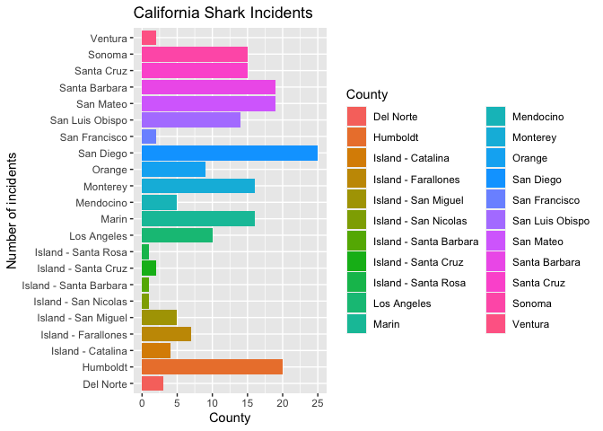
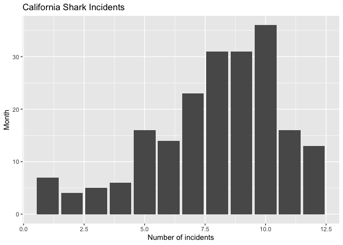
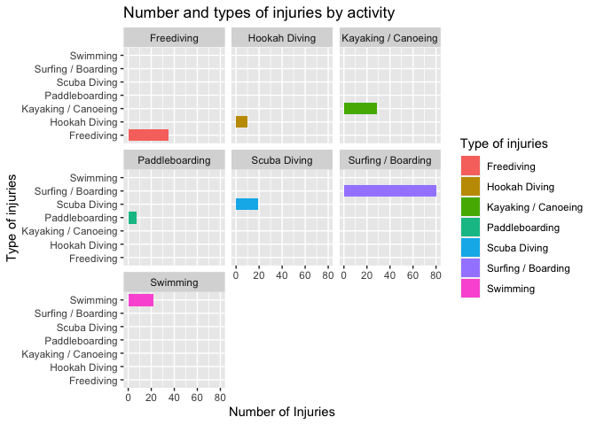
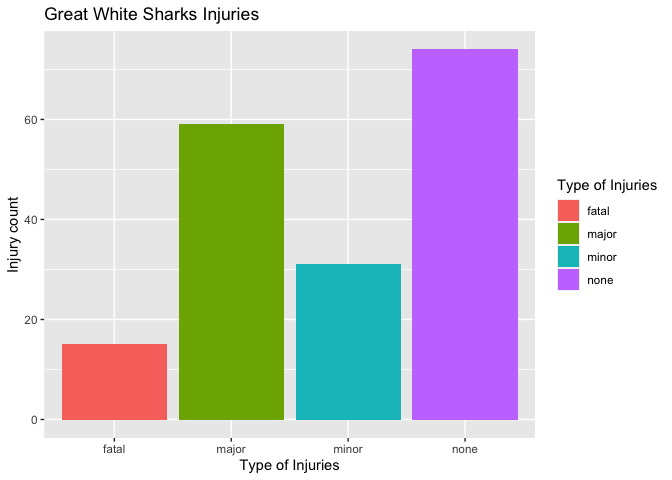
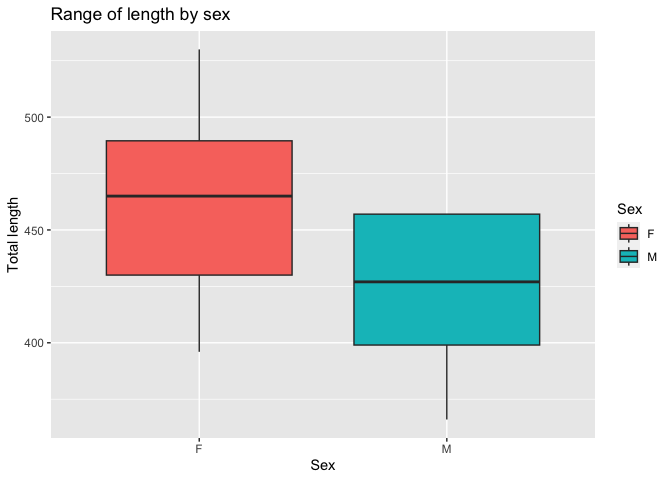
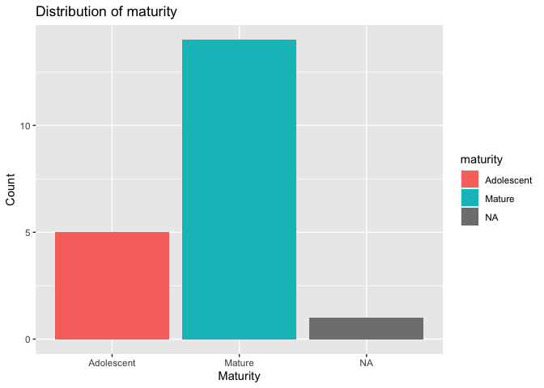

## Instructions
Answer the following questions and complete the exercises in RMarkdown. Please embed all of your code and push your final work to your repository. Your code must be organized, clean, and run free from errors. Remember, you must remove the `#` for any included code chunks to run. Be sure to add your name to the author header above. 

Your code must knit in order to be considered. If you are stuck and cannot answer a question, then comment out your code and knit the document. You may use your notes, labs, and homework to help you complete this exam. Do not use any other resources- including AI assistance.  

Don't forget to answer any questions that are asked in the prompt. Some questions will require a plot, but others do not- make sure to read each question carefully.  

For the questions that require a plot, make sure to have clearly labeled axes and a title. Keep your plots clean and professional-looking, but you are free to add color and other aesthetics.  

Be sure to follow the directions and upload your exam on Gradescope.    

## Background
In the `data` folder, you will find data about shark incidents in California between 1950-2022. The [data](https://catalog.data.gov/dataset/shark-incident-database-california-56167) are from: State of California- Shark Incident Database.   

## Load the libraries

```r
library("tidyverse")
library("janitor")
library("naniar")
```

## Load the data
Run the following code chunk to import the data.

```r
sharks <- read_csv("data/SharkIncidents_1950_2022_220302.csv") %>% clean_names()
```

## Questions
1. (1 point) Start by doing some data exploration using your preferred function(s). What is the structure of the data? Where are the missing values and how are they represented? 

Missing values are represented as NA's or NOT COUNTED

```r
str(sharks)
```

```
## spc_tbl_ [211 × 16] (S3: spec_tbl_df/tbl_df/tbl/data.frame)
##  $ incident_num    : chr [1:211] "1" "2" "3" "4" ...
##  $ month           : num [1:211] 10 5 12 2 8 4 10 5 6 7 ...
##  $ day             : num [1:211] 8 27 7 6 14 28 12 7 14 28 ...
##  $ year            : num [1:211] 1950 1952 1952 1955 1956 ...
##  $ time            : chr [1:211] "12:00" "14:00" "14:00" "12:00" ...
##  $ county          : chr [1:211] "San Diego" "San Diego" "Monterey" "Monterey" ...
##  $ location        : chr [1:211] "Imperial Beach" "Imperial Beach" "Lovers Point" "Pacific Grove" ...
##  $ mode            : chr [1:211] "Swimming" "Swimming" "Swimming" "Freediving" ...
##  $ injury          : chr [1:211] "major" "minor" "fatal" "minor" ...
##  $ depth           : chr [1:211] "surface" "surface" "surface" "surface" ...
##  $ species         : chr [1:211] "White" "White" "White" "White" ...
##  $ comment         : chr [1:211] "Body Surfing, bit multiple times on leg, thigh and body" "Foot & swim fin bitten" "Attacked from below then second time from front, fatal" "Attacked from behind, lost swim fin" ...
##  $ longitude       : chr [1:211] "-117.1466667" "-117.2466667" "-122.05" "-122.15" ...
##  $ latitude        : num [1:211] 32.6 32.6 36.6 36.6 35.1 ...
##  $ confirmed_source: chr [1:211] "Miller/Collier, Coronado Paper, Oceanside Paper" "GSAF - with photos" "Miller/Collier, Coronado Paper" "Miller/Collier, Santa Cruz Sentinel" ...
##  $ wfl_case_number : chr [1:211] NA NA NA NA ...
##  - attr(*, "spec")=
##   .. cols(
##   ..   IncidentNum = col_character(),
##   ..   Month = col_double(),
##   ..   Day = col_double(),
##   ..   Year = col_double(),
##   ..   Time = col_character(),
##   ..   County = col_character(),
##   ..   Location = col_character(),
##   ..   Mode = col_character(),
##   ..   Injury = col_character(),
##   ..   Depth = col_character(),
##   ..   Species = col_character(),
##   ..   Comment = col_character(),
##   ..   Longitude = col_character(),
##   ..   Latitude = col_double(),
##   ..   `Confirmed Source` = col_character(),
##   ..   `WFL Case #` = col_character()
##   .. )
##  - attr(*, "problems")=<externalptr>
```


```r
miss_var_summary(sharks)
```

```
## # A tibble: 16 × 3
##    variable         n_miss pct_miss
##    <chr>             <int>    <dbl>
##  1 wfl_case_number     202   95.7  
##  2 time                  7    3.32 
##  3 latitude              6    2.84 
##  4 longitude             5    2.37 
##  5 confirmed_source      1    0.474
##  6 incident_num          0    0    
##  7 month                 0    0    
##  8 day                   0    0    
##  9 year                  0    0    
## 10 county                0    0    
## 11 location              0    0    
## 12 mode                  0    0    
## 13 injury                0    0    
## 14 depth                 0    0    
## 15 species               0    0    
## 16 comment               0    0
```

2. (1 point) Notice that there are some incidents identified as "NOT COUNTED". These should be removed from the data because they were either not sharks, unverified, or were provoked. It's OK to replace the `sharks` object.


```r
new_sh <- sharks %>% 
  mutate(incident_num=na_if(incident_num, "NOT COUNTED"))
```


3. (3 points) Are there any "hotspots" for shark incidents in California? Make a plot that shows the total number of incidents per county. Which county has the highest number of incidents?

Yes there are hotspots for shark incident and San Diego has the highest number of incidents.

```r
new_sh%>% 
  filter(incident_num != "NA") %>% 
  count(county, sort=T) %>% 
  arrange(desc(n))
```

```
## # A tibble: 21 × 2
##    county              n
##    <chr>           <int>
##  1 San Diego          23
##  2 Santa Barbara      19
##  3 Humboldt           18
##  4 San Mateo          18
##  5 Marin              16
##  6 Monterey           15
##  7 Santa Cruz         15
##  8 Sonoma             15
##  9 San Luis Obispo    14
## 10 Los Angeles         9
## # ℹ 11 more rows
```

```r
sharks%>% 
  filter(incident_num != "NA") %>% 
  count(county, sort = T) %>% 
  arrange(desc(n)) %>% 
  ggplot(aes(x = county, y = n, fill = county))+
  geom_col()+
  coord_flip()+
  labs(title = "California Shark Incidents",
       x = "Number of incidents",
       y = "County",
       fill = "County")
```

<!-- -->


4. (3 points) Are there months of the year when incidents are more likely to occur? Make a plot that shows the total number of incidents by month. Which month has the highest number of incidents?  

October has the highest number of incidents

```r
new_sh %>% 
  filter(incident_num != "NA") %>% 
  count(month, sort=T) %>% 
  arrange(desc(n)) %>% 
  ggplot(aes(x = month, y = n, group= month))+
  geom_col()+
  labs(title = "California Shark Incidents",
       x = "Number of incidents",
       y = "Month",
       fill = "Month")
```

<!-- -->


```r
new_sh %>% 
  filter(incident_num != "NA") %>% 
  count(month, sort=T) %>% 
  arrange(desc(n))
```

```
## # A tibble: 12 × 2
##    month     n
##    <dbl> <int>
##  1    10    36
##  2     8    31
##  3     9    31
##  4     7    23
##  5     5    16
##  6    11    16
##  7     6    14
##  8    12    13
##  9     1     7
## 10     4     6
## 11     3     5
## 12     2     4
```

5. (3 points) How do the number and types of injuries compare by county? Make a table (not a plot) that shows the number of injury types by county. Which county has the highest number of fatalities?  

San Luis Obispo has the highet number of fatalities

```r
new_sh %>% 
  group_by(county) %>% 
  count(injury) %>% 
  pivot_wider(names_from = "county",
              values_from = "n")
```

```
## # A tibble: 7 × 23
##   injury `Del Norte` Humboldt `Island - Catalina` `Island - Farallones`
##   <chr>        <int>    <int>               <int>                 <int>
## 1 minor            2        2                   1                    NA
## 2 none             1        9                   3                    NA
## 3 major           NA        7                  NA                     7
## 4 minor*          NA        1                  NA                    NA
## 5 none*           NA        1                  NA                    NA
## 6 fatal           NA       NA                  NA                    NA
## 7 major*          NA       NA                  NA                    NA
## # ℹ 18 more variables: `Island - San Miguel` <int>,
## #   `Island - San Nicolas` <int>, `Island - Santa Barbara` <int>,
## #   `Island - Santa Cruz` <int>, `Island - Santa Rosa` <int>,
## #   `Los Angeles` <int>, Marin <int>, Mendocino <int>, Monterey <int>,
## #   Orange <int>, `San Diego` <int>, `San Francisco` <int>,
## #   `San Luis Obispo` <int>, `San Mateo` <int>, `Santa Barbara` <int>,
## #   `Santa Cruz` <int>, Sonoma <int>, Ventura <int>
```

```r
new_sh %>% 
  filter(injury == "fatal") %>% 
  group_by(county) %>% 
  count(injury) %>% 
  arrange(desc(n))
```

```
## # A tibble: 10 × 3
## # Groups:   county [10]
##    county              injury     n
##    <chr>               <chr>  <int>
##  1 San Luis Obispo     fatal      3
##  2 Monterey            fatal      2
##  3 San Diego           fatal      2
##  4 Santa Barbara       fatal      2
##  5 Island - San Miguel fatal      1
##  6 Los Angeles         fatal      1
##  7 Mendocino           fatal      1
##  8 San Francisco       fatal      1
##  9 San Mateo           fatal      1
## 10 Santa Cruz          fatal      1
```


6. (2 points) In the data, `mode` refers to a type of activity. Which activity is associated with the highest number of incidents?

Surfing / boarding associated with the highest number of incidents

```r
new_sh%>% 
  filter(incident_num != "NA") %>% 
  count(mode, sort=T) %>% 
  arrange(desc(n))
```

```
## # A tibble: 7 × 2
##   mode                    n
##   <chr>               <int>
## 1 Surfing / Boarding     80
## 2 Freediving             35
## 3 Kayaking / Canoeing    29
## 4 Swimming               22
## 5 Scuba Diving           19
## 6 Hookah Diving          10
## 7 Paddleboarding          7
```

7. (4 points) Use faceting to make a plot that compares the number and types of injuries by activity. (hint: the x axes should be the type of injury) 

```r
new_sh %>% 
  filter(incident_num != "NA") %>% 
  count(mode, sort=T) %>% 
  ggplot(aes(x=mode, y=n, fill=mode))+
  geom_col()+
  facet_wrap(~mode)+
  coord_flip()+
  labs(title = "Number and types of injuries by activity",
       x = "Type of injuries",
       y = "Number of Injuries",
       fill = "Type of injuries")
```

<!-- -->


8. (1 point) Which shark species is involved in the highest number of incidents? 

White sharks involved in the highest number of incidents

```r
new_sh %>% 
  filter(incident_num != "NA") %>% 
  count(species) %>% 
  arrange(desc(n))
```

```
## # A tibble: 8 × 2
##   species        n
##   <chr>      <int>
## 1 White        179
## 2 Unknown       13
## 3 Hammerhead     3
## 4 Blue           2
## 5 Leopard        2
## 6 Salmon         1
## 7 Sevengill      1
## 8 Thresher       1
```


9. (3 points) Are all incidents involving Great White's fatal? Make a plot that shows the number and types of injuries for Great White's only.  

Not all incidents involving Great White is fatal

```r
new_sh %>% 
  filter(incident_num != "NA") %>% 
  filter(species == "White") %>% 
  group_by(injury) %>% 
  ggplot(aes(x=injury, fill = injury))+
  geom_bar()+
  labs(title = "Great White Sharks Injuries",
       x = "Type of Injuries",
       y = "Injury count",
       fill = "Type of Injuries")
```

<!-- -->


## Background
Let's learn a little bit more about Great White sharks by looking at a small dataset that tracked 20 Great White's in the Fallaron Islands. The [data](https://link.springer.com/article/10.1007/s00227-007-0739-4) are from: Weng et al. (2007) Migration and habitat of white sharks (_Carcharodon carcharias_) in the eastern Pacific Ocean.

## Load the data

```r
white_sharks <- read_csv("data/White sharks tracked from Southeast Farallon Island, CA, USA, 1999 2004.csv", na = c("?", "n/a")) %>% clean_names()
```

10. (1 point) Start by doing some data exploration using your preferred function(s). What is the structure of the data? Where are the missing values and how are they represented?

```r
str(white_sharks)
```

```
## spc_tbl_ [20 × 10] (S3: spec_tbl_df/tbl_df/tbl/data.frame)
##  $ shark          : chr [1:20] "1-M" "2-M" "3-M" "4-M" ...
##  $ tagging_date   : chr [1:20] "19-Oct-99" "30-Oct-99" "16-Oct-00" "5-Nov-01" ...
##  $ total_length_cm: num [1:20] 402 366 457 457 488 427 442 380 450 530 ...
##  $ sex            : chr [1:20] "M" "M" "M" "M" ...
##  $ maturity       : chr [1:20] "Mature" "Adolescent" "Mature" "Mature" ...
##  $ pop_up_date    : chr [1:20] "2-Nov-99" "25-Nov-99" "16-Apr-01" "6-May-02" ...
##  $ track_days     : num [1:20] 14 26 182 182 256 275 35 60 209 91 ...
##  $ longitude      : num [1:20] -124 -126 -157 -141 -133 ...
##  $ latitude       : num [1:20] 39 38.7 20.7 26.4 21.1 ...
##  $ comment        : chr [1:20] "Nearshore" "Nearshore" "To Hawaii" "To Hawaii" ...
##  - attr(*, "spec")=
##   .. cols(
##   ..   Shark = col_character(),
##   ..   `Tagging date` = col_character(),
##   ..   `Total length(cm)` = col_double(),
##   ..   Sex = col_character(),
##   ..   Maturity = col_character(),
##   ..   `Pop-up date` = col_character(),
##   ..   `Track days` = col_double(),
##   ..   `Longitude(°)` = col_double(),
##   ..   `Latitude(°)` = col_double(),
##   ..   Comment = col_character()
##   .. )
##  - attr(*, "problems")=<externalptr>
```


```r
miss_var_summary(white_sharks)
```

```
## # A tibble: 10 × 3
##    variable        n_miss pct_miss
##    <chr>            <int>    <dbl>
##  1 sex                  3       15
##  2 maturity             1        5
##  3 longitude            1        5
##  4 latitude             1        5
##  5 shark                0        0
##  6 tagging_date         0        0
##  7 total_length_cm      0        0
##  8 pop_up_date          0        0
##  9 track_days           0        0
## 10 comment              0        0
```


11. (3 points) How do male and female sharks compare in terms of total length? Are males or females larger on average? Do a quick search online to verify your findings. (hint: this is a table, not a plot).  

Female shark has a larger length on average

```r
white_sharks %>% 
  filter(sex !="NA") %>% 
  group_by(sex) %>% 
  summarize(avg = mean(total_length_cm, na.rm = T))
```

```
## # A tibble: 2 × 2
##   sex     avg
##   <chr> <dbl>
## 1 F      462 
## 2 M      425.
```


12. (3 points) Make a plot that compares the range of total length by sex.

```r
white_sharks %>% 
  filter(sex != "NA") %>% 
  group_by(sex) %>% 
  ggplot(aes(x = sex, y = total_length_cm, fill=sex))+
  geom_boxplot(na.rm=T)+
  labs(title = "Range of length by sex",
       x = "Sex",
       y = "Total length",
       fill = "Sex")
```

<!-- -->


13. (2 points) Using the `sharks` or the `white_sharks` data, what is one question that you are interested in exploring? Write the question and answer it using a plot or table. 

What is the distribution of maturity in white_sharks data


```r
white_sharks %>% 
  group_by(maturity) %>% 
  count(maturity) %>% 
  ggplot(aes(x=maturity, y=n, fill=maturity))+
  geom_col()+
  labs(title = "Distribution of maturity",
       x = "Maturity",
       y = "Count")
```

<!-- -->

